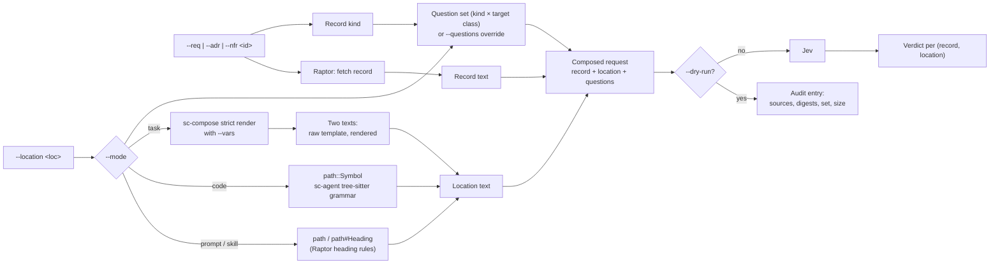

# `judge-jev check`: Jev prompt composition

```mermaid
flowchart LR
    ID["--req | --adr | --nfr &lt;id&gt;"] --> R[Raptor: fetch record] --> RT[Record text]
    ID --> K[Record kind]
    LOC["--location &lt;loc&gt;"] --> M{"--mode"}
    M -- "prompt / skill" --> MD["path / path#Heading<br/>(Raptor heading rules)"] --> LT[Location text]
    M -- code --> TS["path::Symbol<br/>sc-agent tree-sitter grammar"] --> LT
    M -- task --> SC["sc-compose strict render<br/>with --vars"] --> TT["Two texts:<br/>raw template, rendered"] --> LT
    K --> QS["Question set (kind × target class)<br/>or --questions override"]
    M --> QS
    RT --> P["Composed request<br/>record + location + questions"]
    LT --> P
    QS --> P
    P --> DR{"--dry-run?"}
    DR -- yes --> AU["Audit entry:<br/>sources, digests, set, size"]
    DR -- no --> J[Jev] --> V["Verdict per (record, location)"]
```

One request per (record, location); `task` mode sends two. `code` mode waits
for sc-agent's grammars (ADR-JEV-0004).
