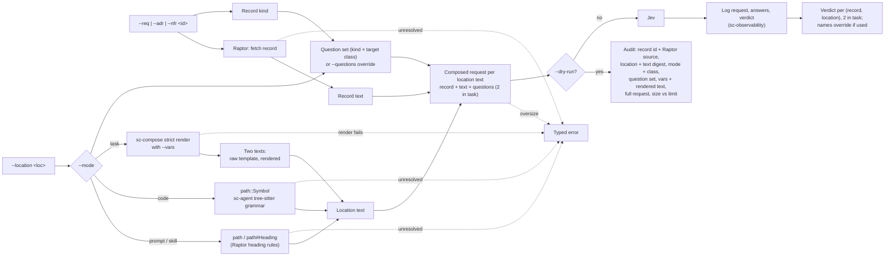

# `judge-jev check`: Jev prompt composition

```mermaid
flowchart LR
    ID["--req | --adr | --nfr &lt;id&gt;"] --> R[Raptor: fetch record] --> RT[Record text]
    ID --> K[Record kind]
    LOC["--location &lt;loc&gt;"] --> M{"--mode"}
    M -- "prompt / skill" --> MD["path / path#Heading<br/>(Raptor heading rules)"] --> LT[Location text]
    M -- code --> TS["path::Symbol<br/>sc-agent tree-sitter grammar"] --> LT
    M -- task --> SC["sc-compose strict render<br/>with --vars"] --> TT["Two texts:<br/>raw template, rendered"] --> LT
    K --> QS["Question set (kind × target class)<br/>or --questions override"]
    M --> QS
    RT --> P["Composed request per location text<br/>record + text + questions (2 in task)"]
    LT --> P
    QS --> P
    R -. unresolved .-> E["Typed error"]
    MD -. unresolved .-> E
    TS -. unresolved .-> E
    SC -. render fails .-> E
    P -. oversize .-> E
    P --> DR{"--dry-run?"}
    DR -- yes --> AU["Audit: record id + Raptor source,<br/>location + text digest, mode + class,<br/>question set, vars + rendered text,<br/>full request, size vs limit"]
    DR -- no --> J[Jev] --> L["Log request, answers, verdict<br/>(sc-observability)"]
    L --> V["Verdict per (record, location), 2 in task;<br/>names override if used"]
```

`code` mode waits for sc-agent's grammars (ADR-JEV-0004).
