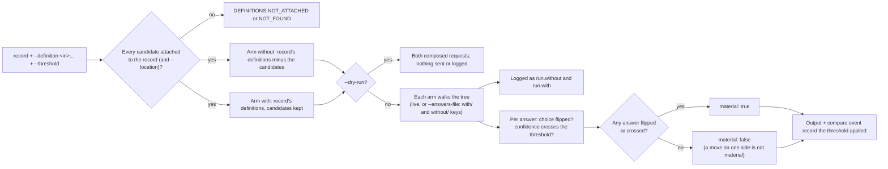

# `judge-jev compare-definition`

```mermaid
flowchart LR
    IN["record + --definition &lt;iri&gt;... + --threshold"] --> A{"Every candidate attached<br/>to the record (and --location)?"}
    A -- no --> E[DEFINITIONS.NOT_ATTACHED or NOT_FOUND]
    A -- yes --> W["Arm without: record's definitions minus the candidates"]
    A -- yes --> X["Arm with: record's definitions, candidates kept"]
    W --> D{"--dry-run?"}
    X --> D
    D -- yes --> P["Both composed requests; nothing sent or logged"]
    D -- no --> K["Each arm walks the tree<br/>(live, or --answers-file: with/ and without/ keys)"]
    K --> LW["Logged as run.without and run.with"]
    K --> C["Per answer: choice flipped?<br/>confidence crosses the threshold?"]
    C --> MAT{"Any answer flipped<br/>or crossed?"}
    MAT -- yes --> Y["material: true"]
    MAT -- no --> N["material: false<br/>(a move on one side is not material)"]
    Y --> O["Output + compare event record the threshold applied"]
    N --> O
```
