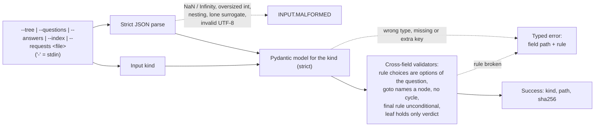

# `judge-jev validate`: input checks

```mermaid
flowchart LR
    F["--tree | --questions | --answers | --index | --requests &lt;file&gt;<br/>('-' = stdin)"] --> K[Input kind]
    F --> J["Strict JSON parse"]
    J -. "NaN / Infinity, oversized int,<br/>nesting, lone surrogate,<br/>invalid UTF-8" .-> E1["INPUT.MALFORMED"]
    J --> M["Pydantic model for the kind (strict)"]
    K --> M
    M -. "wrong type, missing or extra key" .-> E2["Typed error:<br/>field path + rule"]
    M --> X["Cross-field validators:<br/>rule choices are options of the question,<br/>goto names a node, no cycle,<br/>final rule unconditional,<br/>leaf holds only verdict"]
    X -. "rule broken" .-> E2
    X --> S["Success: kind, path, sha256"]
```

`validate` never calls Jev, needs no key and writes no log. `quality` and
`check` run the same checks before their first call (REQ-JEV-0210,
REQ-JEV-0211).
